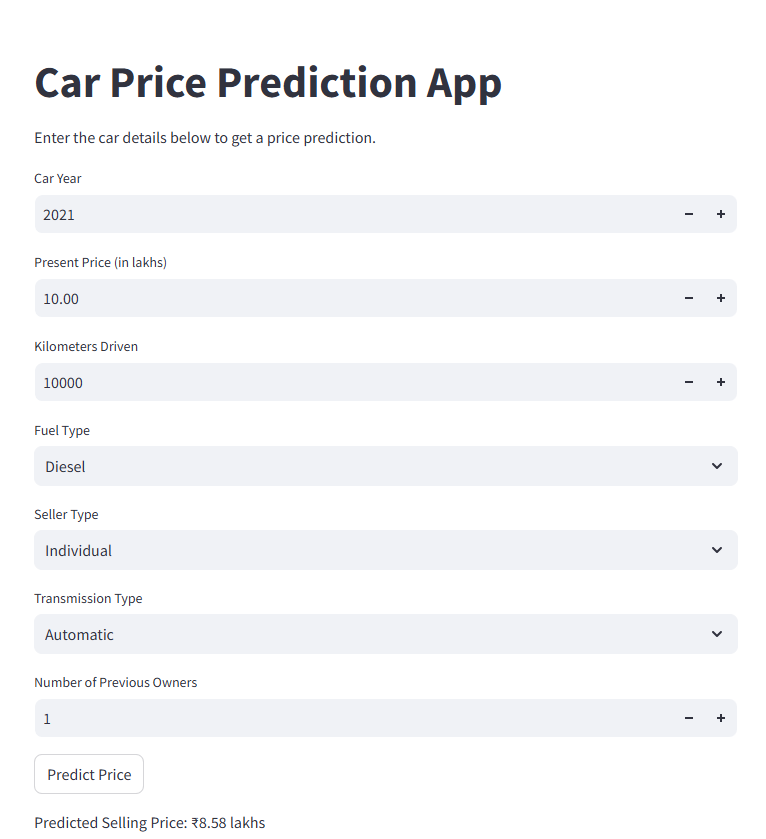
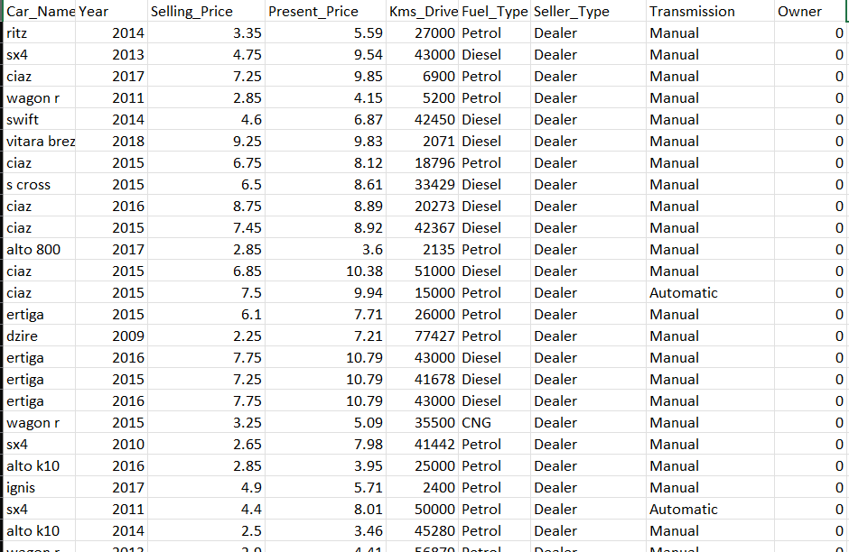

# 🚗 Car Price Prediction Model

Welcome to the Car Price Prediction Model repository! This project uses Linear and Lasso Regression models to predict the prices of used cars accurately, based on 9+ crucial parameters. 

## Table of Contents
- [Overview](#overview)
- [Features](#features)
- [Dataset](#dataset)
- [Modeling Approach](#modeling-approach)
- [Results](#results)
- [Installation](#installation)
- [Usage](#usage)
- [Contributing](#contributing)
- [License](#license)

---

## 🌟 Overview

This model leverages both **Linear Regression** and **Lasso Regression** techniques to estimate the market price of used cars. By considering multiple key features, it helps buyers and sellers make informed decisions.

<p align="center">
    
</p>

---

## ✨ Features

- **Multiple Model Support**: Choose between Linear and Lasso Regression.
- **Multi-parameter Analysis**: The model considers 9+ factors for improved accuracy.
- **User-Friendly**: Simple interface for making predictions.

---

## 📊 Dataset

The dataset contains information on multiple parameters that impact car prices, such as:

- **Car Name**
- **Year of Manufacture**
- **Selling Price**
- **Transmission Type**
- **Fuel Type**
- **Number of Owners**
- And more...

<p align="center">
    
</p>

---

## 🧠 Modeling Approach

1. **Linear Regression**: Provides a baseline model that fits the data linearly.
2. **Lasso Regression**: Adds regularization to the linear model, preventing overfitting and enhancing performance on unseen data.

### Why Linear and Lasso Regression?

- **Linear Regression** provides a straightforward approach to understand the relationships among features.
- **Lasso Regression** is especially effective in feature selection by penalizing less important features, thus enhancing the model's generalizability.

---

## 📈 Results

Below is a comparison of model performance:

| Model            | R² Score |
|------------------|----------|
| Linear Regression| 0.83     |
| Lasso Regression | 0.87     |

**Conclusion**: Lasso Regression often provides a better fit by reducing the impact of irrelevant features.

---

## ⚙️ Installation

1. Clone the repository:
   ```bash
   git clone https://github.com/your-username/car-price-prediction.git
   ```
2. Install the required dependencies:
   ```bash
   pip install -r requirements.txt
   ```

---

## 🚀 Usage

### Training the Model

To train the model on your dataset, use:
```bash
python train_model.py --model linear   # For Linear Regression
python train_model.py --model lasso    # For Lasso Regression
```

### Making Predictions

After training, you can make predictions by running:
```bash
python predict.py --model lasso --input "sample_input.json"
```

Sample JSON format for `sample_input.json`:
```json
{
  "mileage": 12000,
  "year": 2015,
  "engine_capacity": 1500,
  "transmission": "Automatic",
  "fuel_type": "Petrol",
  "owners": 1
}
```

---

## 🤝 Contributing

We welcome contributions to improve this project. Feel free to fork the repository, make changes, and submit a pull request!

---

## 📜 License

This project is licensed under the MIT License - see the [LICENSE](LICENSE) file for details.

---

<p align="center">⭐ If you find this project helpful, please give it a star! ⭐</p>

---

This README provides a comprehensive overview of the project and guides users through setup, usage, and understanding the results. Replace the placeholder image URLs and update any project-specific values (like model metrics) as needed.